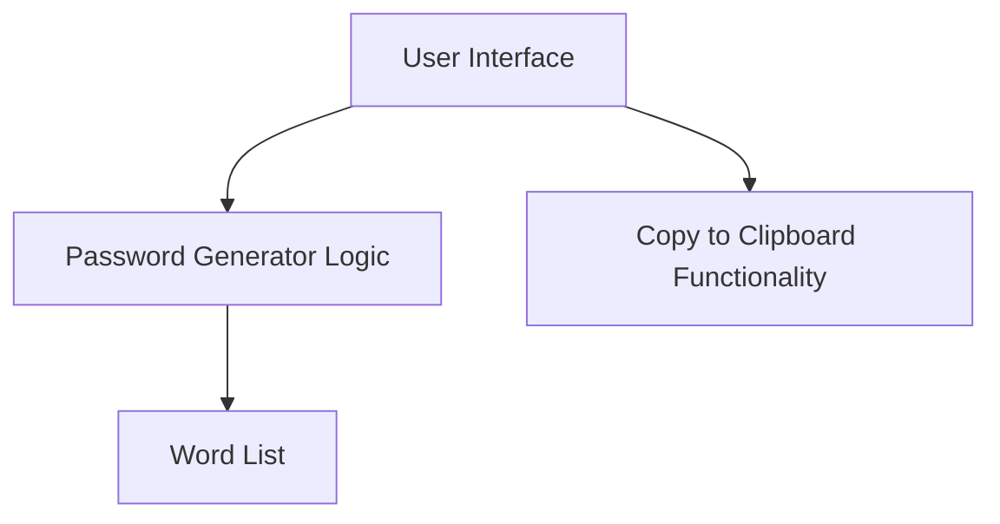

# Password Generator Web Application Plan

This document outlines the plan for creating a lightweight, React-based password generator with Material UI that can be deployed via Docker to an Unraid server.

## Architecture Overview



## Technical Stack

- **Frontend**: React.js with Material UI components
- **State Management**: React hooks (useState, useEffect)
- **Containerization**: Docker
- **Deployment**: Docker image deployable on Unraid server
- **Build Tool**: Create React App or Vite (for lightweight setup)

## Components Breakdown

### 1. Main Application Container
- Houses all components
- Manages application state

### 2. Password Generator Component
- Contains the generation logic
- Accesses the word list
- Implements the algorithm to select three random words

### 3. UI Components
- Material UI styled button to trigger password generation
- Display area for the generated password
- Copy to clipboard button with feedback

### 4. Word List Module
- A JSON file or JavaScript array containing common English words
- We can use an existing word list library or create a curated list of 1000-2000 common words

## Implementation Plan

### Phase 1: Project Setup
1. Initialize a new React project using Create React App or Vite
2. Install Material UI and other necessary dependencies
3. Set up the basic project structure

### Phase 2: Core Functionality
1. Create the word list (either by finding an existing one or creating a new one)
2. Implement the password generation logic
   - Select three random words from the list
   - Convert to lowercase
   - Join with spaces
3. Create the basic UI with Material UI components

### Phase 3: Additional Features
1. Implement copy to clipboard functionality
2. Add visual feedback for user actions (copying, generating)
3. Optimize for mobile and desktop views

### Phase 4: Containerization
1. Create a Dockerfile for the application
2. Build and test the Docker image locally
3. Document the deployment process for Unraid

## Detailed Technical Specifications

### Password Generation Logic
```javascript
// Pseudocode
function generatePassword() {
  // Select 3 random words from the word list
  const selectedWords = [];
  for (let i = 0; i < 3; i++) {
    const randomIndex = Math.floor(Math.random() * wordList.length);
    selectedWords.push(wordList[randomIndex].toLowerCase());
  }
  
  // Join with spaces
  return selectedWords.join(' ');
}
```

### Docker Configuration
```dockerfile
# Base image
FROM node:alpine as build

# Set working directory
WORKDIR /app

# Copy package.json and install dependencies
COPY package*.json ./
RUN npm install

# Copy all files
COPY . .

# Build the app
RUN npm run build

# Production environment
FROM nginx:alpine
COPY --from=build /app/build /usr/share/nginx/html
EXPOSE 80
CMD ["nginx", "-g", "daemon off;"]
```

### Word List Considerations
- We'll need approximately 1000-2000 common English words
- Words should be simple and easy to remember
- We can filter out offensive or complex words
- Options:
  1. Use an existing library like `random-words`
  2. Create our own curated list
  3. Use a public domain word list and filter it

## Timeline Estimate
- Phase 1: 1-2 hours
- Phase 2: 2-3 hours
- Phase 3: 1-2 hours
- Phase 4: 1-2 hours

Total estimated development time: 5-9 hours